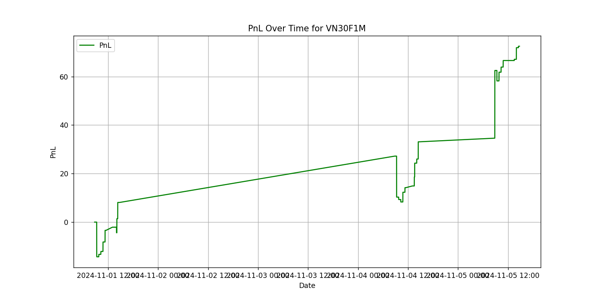
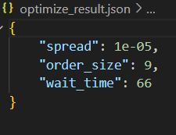

# Plutus Project Template

Template repository of a Plutus Project.

This templte project sturcture also specifies how to store and structure the source code and report of a standard Plutus Project.

This `README.md` file serves as an example how a this will look like in a standard Plutus project. Below listed out the sample section.

## Abstract
- This project is for ALGOTRADE course, we use a simple Market Making stratergy and apply the first 7 steps in Algotrade. We found out that even after optimizing, the simple method is not good enough for the real market

## Introduction

In this project, we aim to develop and optimize a **Market Making strategy** using historical trading data from the **VN30F1M futures market**. Market Making is a common algorithmic trading strategy that involves continuously quoting buy and sell prices to profit from the bid-ask spread.

Despite the simplicity of Market Making as a trading strategy, determining the optimal configuration for parameters such as **spread size**, **order volume**, and **timing intervals** is hard. Bad parameters can lead to poor performance, high inventory risk, and potential losses. The key problem, therefore, is:

> **How can we find the optimal set of Market Making parameters that maximize profit and minimize risk on the VN30F1M futures market?**

#### Method

To solve this problem, we try to implemented a `MarketMaker` algorithm that accepts tunable parameters:

- `spread`: the distance from the mid-price at which to place quotes  
- `order_size`: the volume of each order  
- `wait_time`: the time interval between order refreshes

We used **Optuna** get the best parameters for in-sample-data

#### Results

- For the **in-sample data**, the strategy produced a **positive PnL**.
- However, for the **out-of-sample data**, the strategy still sometime result in a **negative PnL**.
- The current parameters still cannot handle a rising or falling market well
- We haven't applied taxes yet

## Related Work (or Background)
- Prerequisite reading if the audience needs knowledge before exploring the project.
- Optional

## Trading (Algorithm) Hypotheses
By applying the Market Making strategy in the VN30F1M futures market with a spread of x, this strategy can achieve stable profits by taking advantage of small price discrepancies, while maintaining a neutral position with low risk. The Market Maker will provide liquidity to the market and earn profits throughout the trading period, without being significantly affected by short-term price fluctuations or strong volatility.
## Implementation
First clone the project
```bash
git clone https://github.com/algotrade-course/Lets-Go-Gambling.git
cd Lets-Go-Gambling
```
### Environment Setup
1. Set up python virtual environment
```bash
python -m venv venv
source venv/bin/activate # for Linux/MacOS
.\venv\Scripts\activate.bat # for Windows command line
.\venv\Scripts\Activate.ps1 # for Windows PowerShell
```
2. Install the required packages
```bash
pip install -r requirements.txt
```
3. (OPTIONAL) Create `.env` file in the root directory of the project and fill in the required information. The `.env` file is used to store environment variables that are used in the project. The following is an example of a `.env` file:
```env
DB_NAME=<database name>
DB_USER=<database user name>
DB_PASSWORD=<database password>
DB_HOST=<host name or IP address>
DB_PORT=<database port>
```
**Note:** Skip this step if you decide to use the provided `data.csv`.
## Data
- Data source: Algotrade internship database
- Data type: CSV
- Data period: 2024-11-01 to 2024-11-30 (follow "data_params" within settings.py)
- The input data is store in `<DATA_PATH_ROOT>/data.csv` (**DATA_PATH_ROOT** in settings.py)

(Optional) you can get your own data if you have your database setup in .env, in step 3 of **Implementation - Environment Setup** below
```bash
python -m src.data get
```
### Data collection
- Data source: Algotrade internship database
- Data type: CSV
- Data period: 2024-11-01 to 2024-11-30 (follow **data_params** within settings.py)
- The input data is store in `<DATA_PATH_ROOT>/data.csv`
### Data Processing
- This will collect data from data.csv according to **in_sample_params** and **out_sample_params** in settings.py. it will then write to `<DATA_PATH_ROOT>/in_sample_data.csv` and `<DATA_PATH_ROOT>/out_sample_data.csv`
```bash
python -m src.data process
```

## In-sample Backtesting
### Parameters

| Parameter     | Description                   | Default Value    |
|---------------|-------------------------------|------------------|
| `future_code` | Code for the futures contract | `VN30F1M`        |
| `START_DATE`  | Start of the date range       | `2024-11-01`     |
| `END_DATE`    | End of the date range         | `2024-11-06`     |

Run this command to start the in-sample backtesting process:
### Run command
```bash
python -m src.backtest in
```
### Data
- It should be in `<DATA_PATH_ROOT>/in_sample_data.csv` after you process the data
### In-sample Backtesting Result




## Optimization
```bash
python -m src.optimize
```
- Library: Optuna
- Sampler: `TPESampler`
- Number of trials: 100
- Optimization objective: Profit and loss
- Check out [optimize.py](src/optimize.py) for more details.
### Optimization Result


You can see [Trials](data/optuna_trials.csv) in `<DATA_PATH_ROOT>/optuna_trials.csv`

## Out-of-sample Backtesting
### Parameters

| Parameter     | Description                   | Default Value    |
|---------------|-------------------------------|------------------|
| `future_code` | Code for the futures contract | `VN30F1M`        |
| `START_DATE`  | Start of the date range       | `2024-11-09`     |
| `END_DATE`    | End of the date range         | `2024-11-16`     |

Run this command to start the in-sample backtesting process:
### Run command
```bash
python -m src.backtest out
```
### Data
- It should be in `<DATA_PATH_ROOT>/out_sample_data.csv` after you process the data
### Out-of-sample Backtesting Reuslt


## Paper Trading
- Describe the Paper Trading step
- Step 7 of the Nine-Step
- Optional
### Optimization Result
- Brieftly shown the result: table, image, etc.
- Has link to the Paper Trading Report


## Conclusion
- We still cannot handle rising all falling market well with the current parameters

## Reference
- [Market Making](https://hub.algotrade.vn/knowledge-hub/market-making-strategy/)

## Other information
- Link to the Final Report (Paper) should be somewhere in the `README.md` file.
- Please make sure this file is relatively easy to follow.
